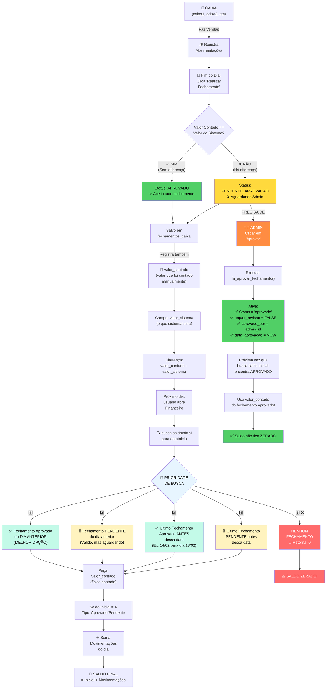

# 📊 Fluxo Completo: Fechamento, Aprovação e Cálculo de Saldo Inicial

## 📋 Visão Geral

Este diagrama ilustra todo o processo de **fechamento de caixa**, **aprovação de diferenças** e **cálculo automático de saldo inicial** para o próximo dia.

---

## 🔄 Fluxo do Sistema



---

## 📌 Pontos Chave

### 1. **Fechamento Automático (Status: APROVADO)**
- ✅ Quando `valor_contado == valor_sistema`
- ✨ Aceito imediatamente, sem aguardar admin
- Usa `valor_contado` como saldo inicial do próximo dia

### 2. **Fechamento com Divergência (Status: PENDENTE_APROVACAO)**
- ❌ Quando `valor_contado ≠ valor_sistema`
- ⏳ Aguarda aprovação do administrador
- Registra a diferença para análise

### 3. **Busca de Saldo Inicial (Prioridade)**
Quando abre a tela Financeiro, o sistema busca nesta ordem:

| Ordem | Condição | Valor | Status |
|-------|----------|-------|--------|
| **1️⃣** | Fechamento do dia anterior | `valor_contado` | ✅ Aprovado |
| **2️⃣** | Fechamento do dia anterior | `valor_contado` | ⏳ Pendente |
| **3️⃣** | Último fechamento anterior | `valor_contado` | ✅ Aprovado |
| **4️⃣** | Último fechamento anterior | `valor_contado` | ⏳ Pendente |
| **5️⃣** | Nenhum encontrado | `0` | ❌ Erro |

### 4. **Aprovação de Fechamentos**
- Admin clica "Aprovar" em **Fechamentos Pendentes de Aprovação**
- Executa `fn_aprovar_fechamento()` no banco
- Define `status = 'aprovado'` e registra `aprovado_por` e `data_aprovacao`
- Próxima busca de saldo inicial encontra o valor aprovado

### 5. **Por que Saldo Fica ZERADO?**
🔴 **Causa raiz:** Nenhum fechamento encontrado em `fechamentos_caixa`

**Soluções:**
1. ✅ Verificar se há fechamentos com status `'aprovado'` ou `'pendente_aprovacao'`
2. ✅ Se houver apenas `'pendente'`, admin precisa aprovar para liberar
3. ✅ Se houver `'rejeitado'`, criar novo fechamento
4. ✅ Se não houver nenhum, fazer primeiro fechamento manualmente

---

## 🔐 Fluxo de Aprovação (Admin Only)

```
┌─────────────────────────────────────────────────────┐
│  CAIXA faz fechamento com diferença                 │
│  → Status: PENDENTE_APROVACAO                       │
└─────────────────────────────────────────────────────┘
                      ↓
┌─────────────────────────────────────────────────────┐
│  ADMIN vê card "Fechamentos Pendentes de Aprovação" │
│  (em Financeiro → AprovacaoFechamentosCard)         │
└─────────────────────────────────────────────────────┘
                      ↓
┌─────────────────────────────────────────────────────┐
│  ADMIN clica "Aprovar" ou "Rejeitar"                │
└─────────────────────────────────────────────────────┘
                      ↓
         ┌────────────┴────────────┐
         ↓                         ↓
    APROVADO                   REJEITADO
    Status: ✅                 Status: ❌
    requer_revisao: FALSE      requer_revisao: TRUE
    aprovado_por: admin_id     motivo_rejeicao: texto
    data_aprovacao: NOW        data_aprovacao: NOW
         ↓                         ↓
    Usa valor_contado        CAIXA refaz o
    para saldo_inicial       fechamento
```

---

## 💡 Exemplo Prático

### Cenário: Fechamento Pendente de 14/02

**14/02 (Caixa 1):**
```
Valor Sistema:   R$ 1.000,00
Valor Contado:   R$ 1.050,00
Diferença:       R$ 50,00 (sobra)
Status:          PENDENTE_APROVACAO ⏳
```

**15/02 (Admin não aprovou ainda):**
```
Abre a tela Financeiro em 15/02
Busca saldo inicial para 15/02:
  1. Procura fechamento aprovado de 14/02 → ❌ não encontra
  2. Procura fechamento pendente de 14/02 → ✅ ENCONTRA!
  3. Usa valor_contado = R$ 1.050,00
  
Saldo Inicial em 15/02 = R$ 1.050,00 ✅
```

**Depois que Admin aprova:**
```
Admin clica "Aprovar" no card de Pendentes
Status muda para: APROVADO ✅
data_aprovacao = 15/02 18:30

Próxima vez que alguém abre Financeiro:
Sistema encontra fechamento aprovado
Usa valor_contado = R$ 1.050,00 normalmente
```

---

## 🎯 Resumo das Regras

| Situação | O que Acontece | Ação do Usuário |
|----------|---|---|
| ✅ Sem diferença | Status = APROVADO automaticamente | Nada, segue normal |
| ❌ Com diferença | Status = PENDENTE_APROVACAO | Admin deve aprovar/rejeitar |
| ⏳ Pendente há dias | Usa valor contado como base | Admin aprova para consolidar |
| 🔴 Nenhum fechamento | Saldo = 0 (ERRO) | Criar primeiro fechamento |

---

## 📁 Componentes Envolvidos

- **useSaldoInicial()** → Hook que busca saldo inicial com as prioridades
- **FechamentoCaixaModal.tsx** → Modal onde caixa faz fechamento
- **AprovacaoFechamentosCard.tsx** → Card onde admin aprova/rejeita
- **fn_aprovar_fechamento()** → Função SQL de aprovação
- **fn_rejeitar_fechamento()** → Função SQL de rejeição

---

**Última atualização:** 18/02/2026
